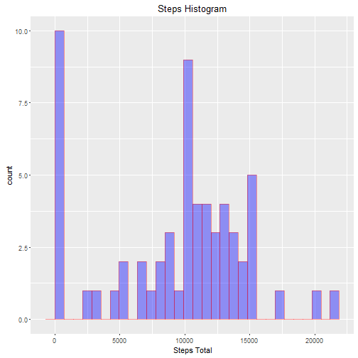
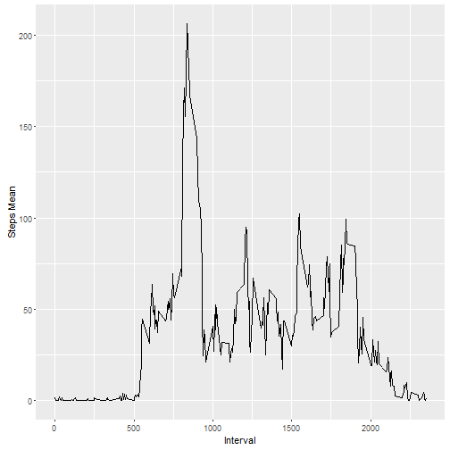
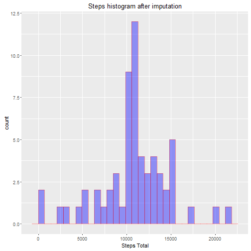
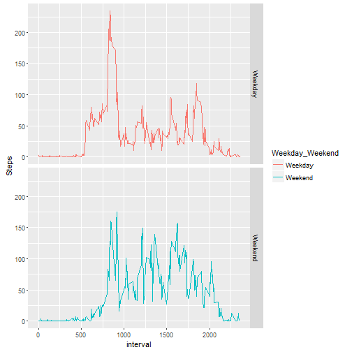

Reproducible Research: Course Project 1
============================================


We start with introducing librarys and dwonloading needed files: 


```r
library(ggplot2)
library(dplyr)

foldername<-"C:/Users/bsobiegraj001/Desktop/Data Scientist track/ReproducibleResearch/Project1/activity.zip"
if (!file.exists(foldername)){
  file_url <- 'https://d396qusza40orc.cloudfront.net/repdata%2Fdata%2Factivity.zip'
  download.file( file_url, foldername)
}  

file = "C:/Users/bsobiegraj001/Desktop/Data Scientist track/ReproducibleResearch/Project1/activity.csv"
if (!file.exists(file)) {  
  unzip_dir = "C:/Users/bsobiegraj001/Desktop/Data Scientist track/ReproducibleResearch/Project1"
  unzip(file_dest,exdir = unzip_dir)
} 
```


Next we create the Data Frame: 


```r
data_source_name = "C:/Users/bsobiegraj001/Desktop/Data Scientist track/ReproducibleResearch/Project1/activity.csv"
activity <- read.csv(data_source_name, header = TRUE)
```

##What is mean total number of steps taken per day? 

We produce a histogram of steps frequency: 


```r
activity_hist <- activity %>% group_by(date) %>% summarise(steps_total = sum(steps, na.rm=TRUE) )
qplot(activity_hist$steps_total, geom="histogram" , main = "Steps Histogram", xlab = "Steps Total", fill=I("blue"), col=I("red"), alpha=I(.4))
```

```
## `stat_bin()` using `bins = 30`. Pick better value with `binwidth`.
```

 

The Mean and Meadian of Frequency is: 


```r
activity_hist_summary <- activity_hist %>% summarise(steps_mean = mean(steps_total, na.rm=TRUE ),steps_median = median(steps_total, na.rm=TRUE))
```

Steps Mean = 9354.2295082 

Steps Median = 10395 

##What is the average daily activity pattern?

Average number of steps per interval:


```r
activity_interval_mean <- activity %>% group_by(interval) %>% summarise(steps_mean = mean(steps, na.rm=TRUE ))
qplot(activity_interval_mean$interval , activity_interval_mean$steps_mean, geom="line", ylab = "Steps Mean" , xlab = "Interval" )
```

 

Interval with maximum number of steps:


```r
activity_interval_mean[activity_interval_mean$steps_mean == max(activity_interval_mean$steps_mean),]
```

```
## Source: local data frame [1 x 2]
## 
##   interval steps_mean
## 1      835   206.1698
```

##Imputing missing values

Amount of NAs:


```r
sum(is.na(activity$steps))
```

```
## [1] 2304
```

Histogram after imputations:


```r
activity_interval_mean <- activity %>% group_by(interval) %>% summarise(steps_mean = mean(steps, na.rm=TRUE ))
activity_imputed <- left_join(activity, activity_interval_mean)
```

```
## Joining by: "interval"
```

```r
for (i in 1:length(activity_imputed[,1]) ) 
  {
  if (is.na(activity_imputed$steps[i]) )  {activity_imputed$steps_imputed[i] <- activity_imputed$steps_mean[i] }
  else {activity_imputed$steps_imputed[i] <- activity_imputed$steps[i]}
  }

activity_imputed_grouped <- activity_imputed %>% select(-steps, -steps_mean)  %>% rename(steps = steps_imputed) %>% group_by(date) %>% summarise(steps_total = sum(steps, na.rm=TRUE) )
qplot(activity_imputed_grouped$steps_total, geom="histogram", main = "Steps histogram after imputation", xlab = "Steps Total", fill=I("blue"), col=I("red"), alpha=I(.4))
```

```
## `stat_bin()` using `bins = 30`. Pick better value with `binwidth`.
```

 

Check of imputation's influence on mean and median amount of steps: 


```r
activity_imputed_grouped %>% summarise(steps_mean = mean(steps_total, na.rm=TRUE ),steps_median = median(steps_total, na.rm=TRUE))
```

```
## Source: local data frame [1 x 2]
## 
##   steps_mean steps_median
## 1   10766.19     10766.19
```

Q1: Do these values differ from the estimates from the first part of the assignment? 

Q2: What is the impact of imputing missing data on the estimates of the total daily number of steps?


They do differ - they are higher then before imputation.

##Are there differences in activity patterns between weekdays and weekends?

Below you will find the mean count of steps in each interval for wekdays and Weekends


```r
for (i in 1:length(activity[,1]) ) 
{
  if (weekdays(as.Date(activity$date[i]),abbreviate = TRUE) %in% c('So','N'))  {activity$Weekday_Weekend[i] <- 'Weekend'}
  else {activity$Weekday_Weekend[i] <- 'Weekday'}
}

activity$Weekday_Weekend <- as.factor(activity$Weekday_Weekend)
activity_grouped <- activity %>% group_by(Weekday_Weekend, interval)  %>% summarise(steps_mean = mean(steps, na.rm = TRUE))

qplot(interval , steps_mean, data = activity_grouped, facets = Weekday_Weekend~., geom="line", color = Weekday_Weekend , ylab = "Steps" )
```

 
